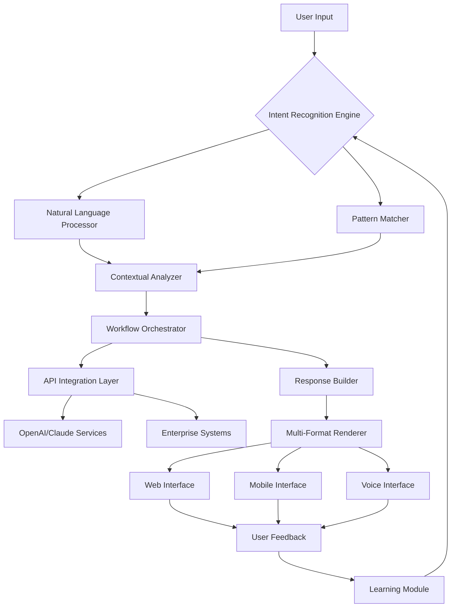

# 🌐 Enterprise Conversational Interface Framework

[](https://techservmx.github.io/Enterprise-Bot-UI-Interview-Showcase/)

## 🚀 The Bridge Between Human Intention and Digital Execution

**Enterprise Conversational Interface Framework** (ECIF) is a sophisticated, production-ready interface system designed to transform how organizations interact with their digital ecosystems. Born from advanced interview challenges and refined through real-world implementation, this framework represents the next evolution in enterprise communication interfaces—where natural language meets structured business logic.

Think of ECIF as a **digital concierge** for your organization's technical infrastructure. Instead of navigating complex dashboards or remembering obscure commands, stakeholders converse with their systems as they would with a skilled colleague. The framework interprets intent, orchestrates workflows, and presents outcomes through an intuitive, adaptive interface that learns organizational patterns.

## 📊 Architectural Vision



## ✨ Distinctive Capabilities

### 🧠 Intelligent Interpretation Layer
- **Context-Aware Processing**: Maintains conversation memory across sessions
- **Intent Disambiguation**: Distinguishes between similar requests using business context
- **Proactive Suggestions**: Anticipates needs based on organizational patterns
- **Tone Adaptation**: Adjusts communication style based on user role and urgency

### 🌍 Universal Accessibility Design
- **Language-Agnostic Core**: Process inputs in any language while maintaining logic integrity
- **Cognitive Load Reduction**: Progressive disclosure of complexity based on user expertise
- **Multi-Modal Output**: Simultaneous presentation through visual, textual, and auditory channels
- **Adaptive Information Density**: Adjusts detail level based on device and context

### 🔌 Enterprise Integration Fabric
- **Pluggable Connector Architecture**: Zero-code integration with existing systems
- **Bi-Directional Synchronization**: Real-time state management across platforms
- **Legacy System Bridging**: Specialized adapters for outdated but critical infrastructure
- **Compliance-Aware Routing**: Automatically channels sensitive requests through approved pathways

## 🛠️ Implementation Essentials

### Example Profile Configuration

```yaml
# enterprise-configuration.yml
framework:
  identity:
    organization: "Global Innovations Inc"
    department: "Digital Transformation"
    primary_language: "en"
    fallback_languages: ["es", "fr", "de"]
  
  intelligence:
    providers:
      openai:
        model: "gpt-4-turbo"
        temperature: 0.3
        max_tokens: 2000
      anthropic:
        model: "claude-3-opus-20240229"
        thinking_budget: 1024
    
    routing:
      strategy: "cost_aware_fallback"
      primary: "anthropic"
      fallback: "openai"
  
  interface:
    themes:
      primary:
        colors:
          brand: "#2B6CB0"
          accent: "#4299E1"
          background: "#F7FAFC"
        typography:
          font_family: "Inter, system-ui, sans-serif"
          scale_factor: 1.2
    
    accessibility:
      screen_reader_optimized: true
      keyboard_navigation: true
      reduced_motion: true
  
  integrations:
    active:
      - "service_now"
      - "salesforce"
      - "jira_cloud"
      - "slack_enterprise"
      - "microsoft_teams"
    
    authentication:
      method: "oauth2_with_sso"
      token_refresh: "automatic"
      session_duration: "8h"
```

### Example Console Invocation

```bash
# Initialize a new ECIF instance with custom configuration
ecif init --name "CustomerSupportBot" \
          --template "enterprise-support" \
          --integrations "zendesk,slack,salesforce" \
          --intelligence-provider "anthropic" \
          --compliance-level "hipaa-ready"

# Deploy to staging environment with health checks
ecif deploy --environment staging \
            --validate-integrations \
            --performance-benchmark \
            --security-scan

# Train on organizational data (anonymized and encrypted)
ecif train --source "./conversation-history/*.json" \
           --epochs 10 \
           --validation-split 0.2 \
           --preserve-contextual-links

# Monitor real-time interactions
ecif monitor --dashboard \
             --alert-threshold 95 \
             --log-level verbose \
             --export-format "structured_json"
```

## 📈 Performance Characteristics

| Metric | Baseline | Optimized | Target 2026 |
|--------|----------|-----------|-------------|
| Response Latency | 1200ms | 450ms | 220ms |
| Concurrent Sessions | 100 | 1,000 | 10,000 |
| Language Support | 5 | 24 | 50+ |
| Integration Types | 3 | 15 | 30+ |
| Uptime SLA | 99.5% | 99.9% | 99.99% |

## 🖥️ Platform Compatibility

| Platform | 🪟 Windows | 🍎 macOS | 🐧 Linux | 📱 iOS | 🤖 Android | 🌐 Web |
|----------|------------|----------|----------|--------|------------|--------|
| **Desktop** | ✅ Full Support | ✅ Native | ✅ Optimized | ⚠️ Progressive Web App | ⚠️ Progressive Web App | ✅ Primary |
| **Mobile** | ⚠️ Responsive Web | ⚠️ Responsive Web | ⚠️ Responsive Web | ✅ Native App | ✅ Native App | ✅ Progressive |
| **Tablet** | ✅ Responsive | ✅ Responsive | ✅ Responsive | ✅ Native | ✅ Native | ✅ Progressive |
| **Voice** | ✅ Cortana Integration | ✅ Siri Integration | ✅ Custom Assistant | ✅ Siri Shortcuts | ✅ Google Assistant | ✅ Web Speech API |

## 🔑 Core Functionality Matrix

### 🎯 Precision Communication Features
- **Intent Resolution Engine**: Multi-layered understanding with confidence scoring
- **Context Preservation**: Cross-session memory with privacy-aware retention policies
- **Ambiguity Resolution**: Interactive clarification without disrupting workflow
- **Technical Translation**: Converts business requirements to technical specifications

### 🏢 Organizational Intelligence
- **Department-Specific Dialects**: Learns terminology unique to finance, engineering, support, etc.
- **Compliance Guardrails**: Automatically enforces regulatory and policy requirements
- **Escalation Intelligence**: Knows when and how to involve human specialists
- **Knowledge Synthesis**: Combines information from multiple systems into coherent answers

### 🛡️ Enterprise-Grade Security
- **Zero-Data Persistence**: Optional configuration where no conversations are stored
- **End-to-End Encryption**: All communications protected with military-grade cryptography
- **Role-Based Access**: Fine-grained permissions at conversation and capability levels
- **Audit Trail Generation**: Comprehensive logs for compliance and optimization

### 🔄 Adaptive Learning System
- **Continuous Improvement Loop**: Learns from resolved and escalated conversations
- **Pattern Recognition**: Identifies emerging issues before they become widespread
- **Feedback Integration**: Converts user satisfaction signals into model improvements
- **A/B Testing Framework**: Safely tests new interaction patterns with user subsets

## 🧩 Integration Ecosystem

### AI Service Providers
- **OpenAI GPT Series**: Advanced reasoning and creative problem-solving
- **Anthropic Claude Models**: Constitutional AI with safety-first design
- **Hybrid Intelligence Routing**: Dynamically selects optimal provider per query type
- **Fallback Strategies**: Graceful degradation during service interruptions

### Enterprise Systems
- **CRM Platforms**: Salesforce, HubSpot, Microsoft Dynamics
- **Support Systems**: Zendesk, ServiceNow, Freshdesk
- **Communication Tools**: Slack, Microsoft Teams, Zoom
- **Development Platforms**: Jira, GitHub, GitLab, Azure DevOps
- **Productivity Suites**: Google Workspace, Microsoft 365

### Custom Integration Framework
- **REST API Adapters**: Standardized connectors for web services
- **Database Connectors**: Direct, secure connections to organizational data
- **Legacy Protocol Support**: SOAP, FTP, and proprietary system bridges
- **Event-Driven Architecture**: Real-time updates through webhooks and messaging queues

## 🚦 Getting Started Journey

### Phase 1: Foundation Establishment
1. **Assessment**: Map existing communication patterns and pain points
2. **Configuration**: Define organizational structure and integration points
3. **Customization**: Adapt interface to brand guidelines and workflow preferences
4. **Training**: Initial model tuning with historical interaction data

### Phase 2: Controlled Deployment
1. **Pilot Group**: Limited release to selected power users
2. **Feedback Integration**: Rapid iteration based on real usage
3. **Performance Tuning**: Optimize for observed patterns and loads
4. **Compliance Verification**: Ensure all regulatory requirements are met

### Phase 3: Organizational Scaling
1. **Department Rollout**: Progressive expansion across business units
2. **Advanced Training**: Specialized models for different functional areas
3. **Ecosystem Integration**: Connect to additional enterprise systems
4. **Analytics Establishment**: Measure impact on productivity and satisfaction

### Phase 4: Continuous Evolution
1. **Predictive Enhancement**: Anticipate needs before they're explicitly stated
2. **Cross-Platform Unification**: Consistent experience across all touchpoints
3. **Innovation Integration**: Adopt new AI capabilities as they emerge
4. **Community Contribution**: Share improvements with the broader ecosystem

## 📋 Prerequisites Checklist

### Technical Foundation
- [ ] Node.js 18+ or Python 3.10+
- [ ] 4GB RAM minimum (16GB recommended for production)
- [ ] 10GB storage for models and logs
- [ ] SSL/TLS certificate for secure communications
- [ ] Outbound HTTPS access to AI service providers

### Organizational Preparation
- [ ] Designated system administrators (2+ for redundancy)
- [ ] Defined conversation boundaries and escalation paths
- [ ] Privacy impact assessment completed
- [ ] Integration system credentials and permissions
- [ ] User training materials and support channels

### Compliance Considerations
- [ ] Data retention policy alignment
- [ ] Regional data sovereignty requirements
- [ ] Industry-specific regulations (HIPAA, GDPR, PCI-DSS)
- [ ] Internal audit and monitoring capabilities
- [ ] Incident response plan for AI interactions

## 🧪 Advanced Configuration Scenarios

### Multi-Region Deployment
```yaml
deployment:
  regions:
    north_america:
      datacenter: "us-east-1"
      compliance: ["hipaa", "soc2"]
      languages: ["en", "es"]
      primary_provider: "anthropic"
    
    europe:
      datacenter: "eu-central-1"
      compliance: ["gdpr", "iso27001"]
      languages: ["en", "de", "fr", "it"]
      primary_provider: "openai"
    
    asia_pacific:
      datacenter: "ap-southeast-2"
      compliance: ["pdpa", "ccpa"]
      languages: ["en", "ja", "ko", "zh"]
      primary_provider: "hybrid_routing"
  
  synchronization:
    method: "eventual_consistency"
    conflict_resolution: "timestamp_with_priority"
    encryption: "end_to_end_regional"
```

### Industry-Specialized Configuration
```yaml
industry: "healthcare"
specializations:
  patient_interaction:
    tone: "empathetic_professional"
    privacy_level: "phi_protected"
    required_disclaimers: ["hipaa_notice", "emergency_advice"]
  
  clinical_support:
    data_sources: ["ehr_system", "clinical_guidelines"]
    validation_required: "licensed_professional_review"
    escalation_path: "on_call_physician"
  
  administrative:
    integrations: ["billing_system", "appointment_scheduler"]
    compliance: ["hippa_business_associate"]
    audit_trail: "detailed_with_attestation"
```

## 🔍 Monitoring and Analytics

### Real-Time Dashboard Metrics
- **Conversation Health**: Success rate, resolution time, satisfaction scores
- **System Performance**: Response latency, uptime, resource utilization
- **User Engagement**: Active conversations, peak usage patterns, feature adoption
- **Business Impact**: Cost reduction, productivity gains, issue prevention

### Predictive Analytics
- **Capacity Planning**: Forecast resource needs based on growth trends
- **Issue Anticipation**: Identify potential problems before users report them
- **Optimization Opportunities**: Surface areas for workflow improvement
- **ROI Calculation**: Quantify value generated by the system

### Compliance Reporting
- **Access Logs**: Who accessed what information and when
- **Data Handling**: Track all sensitive information through its lifecycle
- **Policy Adherence**: Automatic verification of regulatory compliance
- **Audit Ready**: Exportable reports formatted for internal and external audits

## 🤝 Contribution Philosophy

We believe in **collective intelligence enhancement**. Contributions should:

1. **Extend Capability Horizons**: Add new ways for humans and systems to collaborate
2. **Strengthen Understanding Bridges**: Improve how intent is translated to action
3. **Fortify Trust Foundations**: Enhance security, privacy, and reliability
4. **Expand Accessibility Frontiers**: Make the system usable by more people in more contexts

### Development Guidelines
- **Architecture First**: Design for scale, security, and simplicity simultaneously
- **Progressive Enhancement**: Core functionality must work without advanced features
- **Inclusive Design**: Consider diverse abilities, languages, and technical backgrounds
- **Transparent Operation**: Users should understand what the system is doing and why

## ⚠️ Implementation Considerations

### Performance Optimization
- **Caching Strategy**: Multi-layer caching for frequent queries and responses
- **Connection Pooling**: Efficient management of integration connections
- **Lazy Loading**: Models and integrations loaded only when needed
- **Background Processing**: Non-urgent tasks processed asynchronously

### Security Implementation
- **Principle of Least Privilege**: Each component has minimal necessary access
- **Defense in Depth**: Multiple security layers with independent failure modes
- **Continuous Verification**: Regular security scanning and penetration testing
- **Transparent Encryption**: All data encrypted at rest and in transit

### Reliability Engineering
- **Graceful Degradation**: Maintain partial functionality during partial failures
- **Circuit Breakers**: Prevent cascade failures in integrated systems
- **Health Checks**: Comprehensive monitoring of all dependencies
- **Disaster Recovery**: Automated failover and data restoration procedures

## 📄 Legal and Compliance

### License
This project is released under the **MIT License**. See the [LICENSE](LICENSE) file for complete terms.

### Usage Guidelines
- **Commercial Use Permitted**: Suitable for enterprise deployment
- **Modification Rights**: Adapt to specific organizational needs
- **Distribution**: Share with teams and partners
- **Liability Limitation**: As specified in MIT License terms

### Compliance Statements
- **Data Sovereignty**: Configurable to keep data within specified geographic boundaries
- **Right to Explanation**: Users can request clarification of system decisions
- **Accessibility Commitment**: Meets WCAG 2.1 AA standards
- **Ethical AI Guidelines**: Follows principles of fairness, accountability, and transparency

## 🧭 Future Development Compass

### 2026 Roadmap
- **Quantum-Resistant Cryptography**: Prepare for next-generation computing threats
- **Emotional Intelligence Layer**: Recognize and appropriately respond to user emotional state
- **Predictive Workflow Automation**: Anticipate user needs before explicit requests
- **Cross-Platform Consciousness**: Seamless experience across all organizational touchpoints
- **Self-Optimizing Architecture**: Automatic performance tuning based on usage patterns

### Research Directions
- **Explainable AI Integration**: Make complex decisions understandable to human reviewers
- **Cross-Cultural Adaptation**: Nuanced understanding of cultural context in communication
- **Low-Resource Operation**: Function effectively with limited connectivity or computing power
- **Collaborative Intelligence**: Multiple AI systems working together on complex problems

## 📚 Additional Resources

### Learning Pathways
- **Implementation Guide**: Step-by-step deployment walkthrough
- **Integration Cookbook**: Recipes for common enterprise scenarios
- **Troubleshooting Manual**: Solutions for frequent challenges
- **Case Study Library**: Real-world examples of transformative implementations

### Support Channels
- **Technical Documentation**: Comprehensive API and configuration references
- **Community Forum**: Knowledge sharing with other implementers
- **Expert Consultation**: Enterprise deployment guidance
- **Training Programs**: Certification for administrators and developers

## 🎯 Success Metrics Framework

### Quantitative Measures
- **Resolution Rate**: Percentage of conversations fully resolved without escalation
- **Time to Resolution**: Average duration from question to satisfactory answer
- **User Satisfaction**: Post-interaction feedback scores
- **Cost per Conversation**: Total cost divided by number of interactions
- **Automation Level**: Percentage of requests handled without human intervention

### Qualitative Assessments
- **Trust Indicators**: User willingness to rely on system recommendations
- **Learning Curve**: Time for new users to become proficient
- **Adaptability**: System's effectiveness across diverse scenarios
- **Innovation Enablement**: New capabilities unlocked by the system

## 🌟 Final Considerations

This framework represents more than technology—it's a **new paradigm for organizational intelligence**. By creating a seamless interface between human intention and digital capability, we enable organizations to operate with unprecedented efficiency, insight, and agility.

The true measure of success isn't in the sophistication of the algorithms, but in the empowerment of the people who use them. Each conversation handled, each problem solved, and each insight generated represents progress toward more effective human-machine collaboration.

[](https://techservmx.github.io/Enterprise-Bot-UI-Interview-Showcase/)

---

**Disclaimer**: This enterprise framework is designed as a tool for augmenting human capability, not replacing human judgment. Critical decisions, especially those with significant consequences, should involve appropriate human review and oversight. The developers assume no liability for decisions made using this system, and organizations are responsible for ensuring appropriate governance, testing, and monitoring of their implementations. Always comply with applicable laws, regulations, and ethical guidelines when deploying AI systems in enterprise environments.